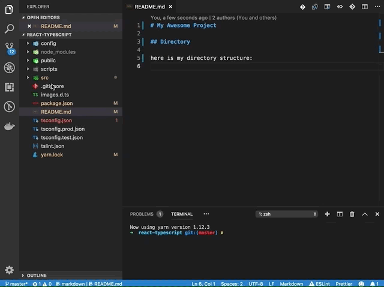

# ascii tree generator

A VS Code plugin to generate ascii tree of directories or formatting selected text to tree strings.

## Working In Progress

This plugin is currently working in progress and not available in market yet.

## Usage

This plugin provide convenient way to generate ascii tree strings for directory in workspace explorer. Besides, you can select text in editor and format it to tree strings easily.

### Generate Tree Strings for Directory

Right click on `Explorer` directories, click `Generate Tree Strings for Directory` menu:



### Format Text to Tree Strings

Write simple tree lines in certain syntax (see example below), select these lines, right-click and choose `Format Text to Tree Strings`:


The following kinds of line syntax is supported to correctly format to tree strings:

- lines started with `indent(space or tab)` characters:
  
  ```
  public
  dist
    index.d.ts
    index.js
  src
    index.ts
  ```

- line started with `hash(#)` symbol

  ```
  # public
  # dist
  ## index.d.ts
  ## index.js
  # src
  ## index.ts
  ```

They should be formatted to:

```
.
├── public
├── dist
│   ├── index.d.ts
│   └── index.js
└── src
    └── index.ts
```

## Configuration

|key|default|description|
|---|---|---|
|sort|true||
|ignore|||
|maxDepth|Number.MAX_VALUE||
|charset|||

## Todo

- ~formatFromText: read current user selected texts~
- ~disable command panel command~
- read user configuration
- ~formatFromDirectory: add 'copy to clipboard' button in webview~
- i18n

### VS Code Reference

- [api reference](https://code.visualstudio.com/api/references/vscode-api#Uri)
- [`when` clause context](https://code.visualstudio.com/docs/getstarted/keybindings#_when-clause-contexts)
- [`menu` group types](https://code.visualstudio.com/api/references/contribution-points#Sorting-of-groups)

### Other Reference

- <https://en.wikipedia.org/wiki/Tree_(command)>
- <https://www.geeksforgeeks.org/tree-command-unixlinux/>
- <https://stackoverflow.com/questions/19699059/representing-directory-file-structure-in-markdown-syntax>
- <https://code.visualstudio.com/api/get-started/wrapping-up>
- <https://github.com/mbr/asciitree>
- <https://www.npmjs.com/package/ascii-tree>
- <https://atom.io/packages/ascii-tree>
- <https://unix.stackexchange.com/questions/127063/tree-command-output-with-pure-7-bit-ascii-output>